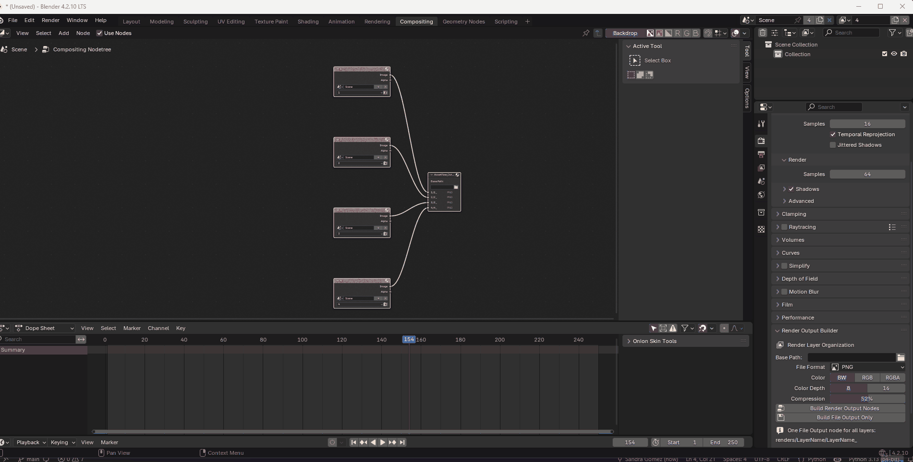

# AssetFlow Toolkit 

**Pipeline utilities for Blender production workflows.**

AssetFlow is a lightweight Blender addon suite built for hybrid 2D/3D production pipelines. Both tools address specific pain points that appear repeatedly in studio environments where technical artists, animators and 2D artists share the same scenes.

V1.4.1 Just released!

## Tools

### GP Vertex Paint Cleaner

In hybrid 2D/3D productions, 2D artists frequently activate Vertex Paint mode accidentally while working in Solid View. Since vertex color layers are not visible in Solid View, the issue often goes unnoticed until the scene is rendered or handed off — at which point materials look broken and cleaning has to be done manually, object by object.

This tool removes all vertex color data from every Grease Pencil object in the scene in one click.


### Render Output Builder
 
Automatically sets up compositor nodes and File Output structure for all View Layers in the scene.
 


 
Two modes:
 
- **Build Full Compositor** — creates one Render Layer node per View Layer and connects them all to a single File Output node
- **Build File Output Only** — detects existing Render Layer nodes in the compositor and generates the File Output from them
Output folder structure:
 
```
renders/
├── LayerName/
│   └── LayerName_
├── LayerName/
│   └── LayerName_
```
 
**Use case:** Multi-layer render setups where manually creating and connecting nodes for each View Layer is repetitive and error-prone.
 
---

## In Development

### Missing Files Cleaner
Scans the scene for missing external file references — textures, libraries, 
sounds, movie clips, fonts and volumes — and removes them in one click. 
Simulation caches are flagged for manual cleanup.

> ⚠️ Sequencer strip removal currently not supported due to Blender 4.x API limitations.
 
## Installation
 
1. Download the latest `.zip` from [Releases](../../releases)
2. Open Blender → **Edit → Preferences → Add-ons → Install**
3. Select the downloaded `.zip`
4. Search **AssetFlow** and enable the checkbox
**Requires Blender 3.6 or later.**
 
---
 
## Usage
 
### GP Vertex Paint Cleaner
`3D Viewport → Sidebar (N) → AssetFlow → Clean Vertex Paint`
 
### Render Output Builder
`Properties → Render → Render Output Builder`
 
Configure base path and file format, then click **Build Full Compositor** or **Build File Output Only**.
---
